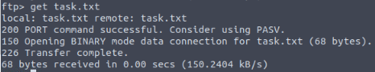
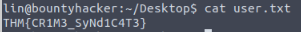

author: Antonio Peñalver Caro
id: Máquina Cowboy Hacker
categories: Hacking Ético
environments: Web
status: Published

# Máquina: Cowboy Hacker

En esta máquina, lo primero que haremos será realizar un “NMap” a la dirección IP objetivo para ver qué puertos tiene abiertos.

Al finalizar el escaneo, podremos comprobar que la máquina tiene los siguientes puertos abiertos:

Como tiene el puerto 21 abierto, el cual pertenece al servicio FTP, vamos a intentar acceder a él como usuario anónimo (anonymous) a través del siguiente comando:

Una vez dentro, intentaremos listar el contenido del servidor FTP a con el comando “ls”.

Tal y como se observa en la imagen anterior, el servidor nos ha mostrado un par de ficheros de texto, de los cuales desconocemos (Por el momento) su contenido.

Para poder visualizar el contenido de los ficheros, nos los tendremos que descargar primero con el comando “get (NombreFichero)”.

Ahora que los tenemos descargados, nos saldremos del FTP y le lanzaremos un “cat” a ambos ficheros para ver qué contienen:

Contenido de locks.txt:

Contenido de task.txt:

Aparentemente, el fichero locks.txt contiene posibles contraseñas de usuario. Y el fichero task.txt contiene un posible nombre de usuario, el cual se llama lin.

A continuación, lo que vamos a hacer, es realizar un ataque de fuerza brutal al fichero locks.txt, para ver qué contraseña es la que nos va a permitir acceder por SSH a la máquina anfitriona.

Para ello, utilizaremos el comando “hydra” con los siguientes parámetros:

Como podemos observar en la imagen anterior, el comando “hydra” nos ha devuelto la contraseña que tenemos que utilizar para poder acceder a la máquina anfitriona por SSH.

Ahora lo que vamos a hacer, es acceder con las credenciales que hemos obtenido al servicio SSH de la máquina objetivo:

Como se observa en la imagen anterior, ya estamos dentro de la máquina anfitriona. Ahora vamos a realizar un “ls” para ver si hay algo dentro del directorio en que nos encontramos:

En la imagen anterior, se ve que hay un fichero llamado user.txt, entonces lo que vamos a hacer ahora, es ver qué hay dentro de dicho fichero:

Lo que nos muestra es el fichero, es una de las flags del ejercicio.

Por último, vamos a realizar una pequeña escalada de privilegios para poder descubrir cuál es la última flag del ejercicio. Para ello, tendremos que usar el comando “sudo -l” para ver qué puede ejecutar el usuario lin como administrador.

lin puede usar el comando “tar” como administrador, por lo tanto, nos vamos a ir a la página GTFOBins y buscaremos si se puede explotar dicho comando:

En la página hay varias maneras de explotar dicho comando, pero nosotros vamos a utilizar la primera opción que nos ofrece:

Como se observa en la imagen anterior, ya hemos conseguido acceder como administrador a la máquina anfitriona y accediendo a la carpeta de “root”, conseguimos sacar el fichero “root.txt”, el cual necesitábamos para poder obtener la última flag.

Le realizamos un “cat” al fichero y este nos devolverá como resultado la última flag.

